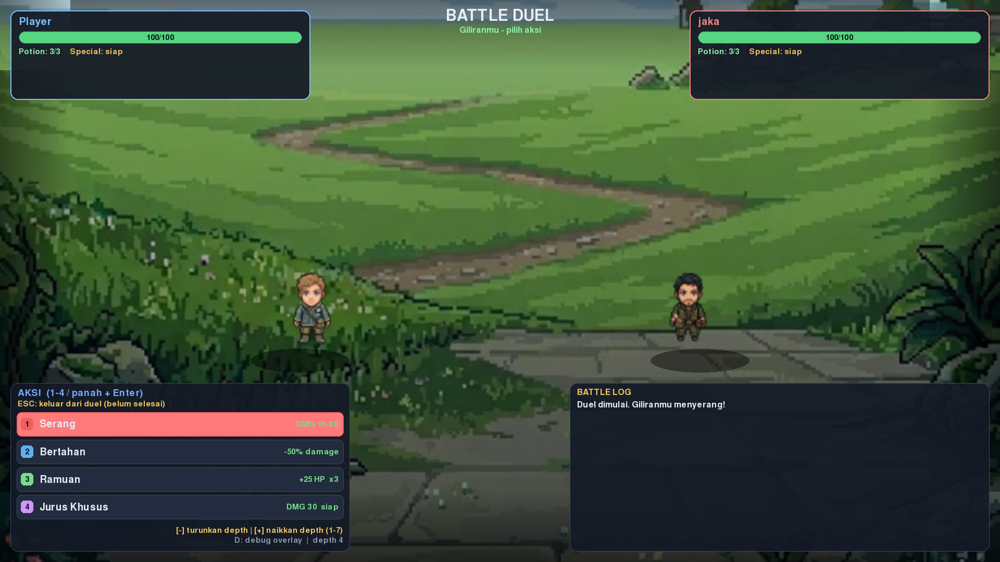

# Game AI — Adversarial Search (Tahap 2)

README ini khusus membahas **adversarial search**: duel turn-based melawan NPC
yang diselesaikan dengan Minimax, alpha-beta pruning, move ordering, dan early
stop. Mode battle aktif otomatis saat Player mendekati musuh, lalu hasil
pencarian AI-nya bisa dilihat langsung lewat debug overlay.

Topik Tahap 1 (pathfinding A\* dan UCS di grid 2D) sengaja **tidak dibahas di
sini** — dokumentasinya ada di README cabang lain. Di dokumen ini pergerakan
hanya disinggung sepanjang yang dibutuhkan untuk menjalankan duel.

Fokus tubes tahap 2 adalah komponen AI, bukan game design.

## Instalasi

```bash
pip install -r requirements.txt   # pygame 2.6.1, pygbag
python main.py                    # jalankan game
```

Python 3.10+. Paket `pygame` (bukan `pygame-ce`) yang dipakai; versi 2.6.1
sudah termasuk dukungan Python 3.13. Yang terpasang di environment penulis
adalah `pygame-ce 2.5.8` dan kode tetap berjalan di sana, jadi
pengganti `pygame-ce` juga aman kalau `pygame` gagal terpasang.

## Menjalankan duel dan melihat AI-nya

Tidak perlu menyetel apa pun untuk melihat AI-nya bekerja; aset dan peta sudah
termasuk di repository. Musuh muncul di lokasi acak yang cukup jauh, lalu
langsung mengejar Player (mode follow aktif, bisa dimatikan dengan `F`).
Duel dimulai otomatis saat jarak Manhattan Player dan NPC <= 1 ubin
(`BATTLE_TRIGGER_DIST = 1` di `main.py`). Game **tidak langsung** masuk menu
pertarungan saat baru dinyalakan: musuh pertama baru muncul setelah
`INITIAL_ENEMY_SPAWN_DELAY = 8` detik, jadi ada waktu jalan-jalan dulu. Setelah
duel selesai ada jeda `ENEMY_RESPAWN_DELAY = 5` detik (di `main.py`) sebelum
musuh baru muncul, lalu langsung mengejar lagi.

Setiap pertarungan selesai — menang, kalah, seri, maupun keluar paksa dengan
`ESC` — darah Player selalu di-reset penuh (100 = `MAX_HP`).

Posisi Player selalu dipertahankan: setelah duel selesai — maupun setelah
tombol `R` / tombol **Reset Duel** di menu ESC — permainan dilanjutkan dari
titik yang sama persis seperti saat war dimulai, tanpa kembali ke posisi awal
peta.

| Tombol (saat duel) | Fungsi |
|-----|--------|
| `1` / `2` / `3` / `4` | Pilih ATTACK / DEFEND / POTION / SPECIAL |
| `W` `S` atau `↑` `↓` | Geser pilihan aksi |
| `Enter` / `Space` | Konfirmasi aksi |
| `D` | Tampilkan / sembunyikan debug overlay AI |
| `-` / `+` | Turunkan / naikkan kedalaman pencarian AI (1–7; `=` juga berfungsi); overlay langsung dihitung ulang pada state yang sama. Keterangannya tampil di menu aksi |
| `ESC` | Keluar dari Battle Mode walaupun duel belum selesai |

Overlay menampilkan skor evaluasi tiap aksi yang dipertimbangkan NPC, jumlah
node minimax versus alpha-beta, node terpangkas, efisiensi pruning, jumlah
cutoff, evaluasi daun, waktu kalkulasi, fungsi evaluasi, dan urutan aksi.

Panel selalu ditempatkan di **sisi kanan layar duel**: lebarnya mengikuti area
aman (di antara panel NPC dan battle log) sehingga tetap tampil di pinggir untuk
semua resolusi umum (1920x1080, 1600x900, 1440x900, 1366x768, 1280x720, dst.),
dengan tinggi baris minimum 9 px. Mode modal (panel di tengah layar + tirai
gelap) hanya dipakai sebagai cadangan untuk layar sangat sempit (di bawah
sekitar 1152 px lebar) yang teksnya sudah tidak terbaca bila disusutkan.

## Eksperimen

```bash
python experiments.py                            # E0-E7, hasil dicetak ke stdout
python experiments.py --log-csv data/duel_log.csv   # + log per giliran NPC
python experiments.py --only E7                  # hanya perbandingan branching 3 vs 4
python experiments.py --quick                    # iterasi cepat dengan lebih sedikit state
python adversarial_ai.py                         # self-test: alpha-beta harus = minimax
```

`experiments.py` menjalankan E0 sampai E7: horizon dan kondisi early stop,
perbandingan algoritma, fungsi evaluasi, urutan aksi, kedalaman, perilaku NPC
terhadap tiga lawan, dan branching 3 versus 4. Semua angka yang
dikutip pada bagian **Adversarial Search** berasal dari perintah di
atas, tanpa diedit tangan.

| Berkas | Isi |
|--------|-----|
| `data/duel_log.csv` | Log per giliran NPC untuk 60 duel (deterministik, seed tetap) |

## Struktur Proyek

```text
Game AI/
├── main.py                        game loop, input, pemicu duel
├── player.py                      pergerakan Player (A* / UCS = Tahap 1)
├── npc.py                         NPC follow dengan A* (Tahap 1)
├── battle_system.py               duel: giliran, aksi, UI panel, tombol depth
├── adversarial_ai.py              Tahap 2: state, eval, minimax, alpha-beta
├── debug_overlay.py               BattleDebugOverlay (Tahap 2) + DebugOverlay (Tahap 1)
├── settings_menu.py               menu pengaturan
├── experiments.py                 harness E0-E7
├── requirements.txt               dependensi: pygame, pygbag
├── Readme.md                      dokumen yang sedang Anda baca
├── .gitignore                     abaikan __pycache__, venv, build
│
├── game/                          paket inti game
│   ├── __init__.py
│   ├── map/
│   │   ├── __init__.py
│   │   ├── core.py                grid, collision, viewport, deteksi obstacle
│   │   └── utils.py               utilitas koordinat & kamera
│   ├── pathfinding/
│   │   ├── __init__.py
│   │   └── core.py                implementasi inti A* dan UCS
│   └── adv_search/
│       ├── __init__.py
│       └── core.py                facade ke adversarial_ai.py
│
├── docs/
│   └── screenshots/                     screenshot README (diisi manual)
│
├── data/                          data yang dibaca/ditulis saat bermain
│   ├── grid_override.txt          hasil simpan grid dari editor
│   └── duel_log.csv               log per giliran NPC, 60 duel (seed tetap)
│
├── assets/
│   └── images/                    sprite peta: terrain, air, bangunan, karakter, dll.
│
└── .github/
    └── workflows/
        └── deploy.yml             build pygbag + deploy ke GitHub Pages
```

`__pycache__/`, `venv/`, dan `build/` (output pygbag) di-ignore lewat
`.gitignore`, jadi tidak muncul di atas.

## Tangkapan Layar

Taruh screenshot di `docs/screenshots/` dengan nama persis seperti di tabel,
gambar di bawah akan tampil otomatis — tidak perlu file `.md` tambahan.
Screenshot pathfinding (Tahap 1) tidak dipakai di README ini.

| Berkas | Isi singkat |
|--------|-------------|
| `tahap2-menu-duel.png` | Layar duel: HP, 4 aksi, battle log |
| `tahap2-overlay-minimax.png` | Debug overlay AI (tombol `D`): skor aksi + statistik node |
| `tahap2-overlay-pruning.png` | Overlay giliran lain: node alpha-beta < minimax, pruning > 0% |
| `tahap2-overlay-depth.png` | Overlay dengan kedalaman diganti (tombol `-`/`+`) |

<!-- TODO: drop file di docs/screenshots/ dengan nama yang sama, gambar tampil otomatis -->



## Adversarial Search

Duel bergiliran: Player memilih satu dari empat aksi (`ATTACK`, `DEFEND`,
`POTION`, `SPECIAL`), NPC menjawab dengan aksi hasil pencarian adversarial.
Asumsi pemodelan, perbandingan algoritma, dan pembahasan eksperimen dirangkum
di bagian ini; semua angkanya dihasilkan oleh `experiments.py`.

### Formulasi masalah

| Unsur | Representasi |
|-------|--------------|
| State | `BattleState`: HP Player, HP NPC, sisa potion, status buff/armor, giliran |
| Pemain | Dua: NPC (maximizer) dan Player (minimizer) |
| Aksi | `ATTACK`, `DEFEND`, `POTION`, `SPECIAL` → branching maksimum 4 (`POTION`/`SPECIAL` hanya bila legal) |
| Kedalaman | 4 ply per giliran (`DEFAULT_DEPTH = 4`) |
| Terminal | `BattleState.is_terminal()`: `player_hp ≤ 0` atau `npc_hp ≤ 0`, lalu skor terminal `± WIN_SCORE` |
| Utilitas | `eval_balanced` (default): selisih HP + selisih potion × 10 + bonus defend ± 15 + bonus terminal |

### Algoritma yang diimplementasikan

| Algoritma | Ide singkat | Tempat |
|-----------|-------------|--------|
| **Minimax** | NPC memaksimalkan skor, Player meminimalkan; jadi patokan tanpa pruning | `adversarial_ai.py` |
| **Alpha-beta pruning** | Memangkas subtree yang mustahil mengalahkan skor terbaik yang sudah diketahui | `adversarial_ai.py` |
| **Move ordering** | Aksi yang kemungkinan terbaik dicoba lebih dulu sehingga window menutup lebih cepat | `MOVE_ORDERS` |
| **Early stop** | Pemangkasan tambahan bila `is_decided(state)` — satu pihak pasti mati, pihak lain tidak, jadi hasil akhir tidak berubah lagi | `is_decided()` |

**Alpha-beta bukan algoritma baru — ia hanya minimax yang lebih hemat.**
Yang dipotong adalah bagian pohon yang **mustahil mengubah keputusan akhir**,
sehingga skor dan aksi yang dipilih **dijamin identik dengan minimax**; yang
berbeda hanya jumlah node yang dihitung. Bukti empirisnya ada di self-test
`python adversarial_ai.py` (aksi sama pada kedalaman 1-6, node lebih sedikit).

### Alur kerja di dalam game

1. Player memilih aksi → `BattleSystem._resolve()` menerapkannya ke
   `BattleState`, lalu giliran berpindah ke NPC.
2. Setelah jeda `NPC_THINK_DELAY`, `BattleSystem.update()` memanggil
   `AdversarialAI.think(state, depth)` (`adversarial_ai.py`).
3. `think()` membangun pohon permainan sedalam `depth` ply: tiap simpul adalah
   `BattleState`, anaknya adalah aksi legal (`POTION`/`SPECIAL` hanya muncul
   bila tersedia), lewat `apply_action()` yang menghasilkan state baru.
4. Daun dinilai fungsi evaluasi (`eval_balanced` secara default), lalu nilainya
   mundur ke akar dengan aturan max untuk NPC dan min untuk Player; akar
   memilih aksi dengan skor tertinggi.
5. `think()` mengembalikan statistik akar (skor tiap aksi, node minimax vs
   alpha-beta, node terpangkas, cutoff, waktu) → disimpan di
   `BattleSystem.ai_stats` → dikirim ke `BattleDebugOverlay` (tombol `D`).
6. Agar perbandingan selalu tersedia, `think()` juga menjalankan minimax murni
   sebagai baseline tiap giliran (`run_baseline=True`), jadi overlay tidak
   perlu pencarian tambahan untuk menampilkan kedua angka node.

Konfigurasi yang dipakai saat duel berlangsung: `algorithm = "alphabeta"`,
`eval = "balanced"`, `order = "default"`, `depth = 4`, dengan `early_stop`
**nonaktif** (hasil eksperimennya tetap dilaporkan di bawah). Statistik tiap
giliran (node, cutoff, terpangkas, waktu) ditampilkan lewat
`BattleDebugOverlay` dengan tombol `D`.

Kedalaman bisa diubah **saat duel berjalan** dengan `-` (turunkan) dan `+` /
`=` (naikkan), rentang 1–7 mengikuti rentang eksperimen E1/E4. Keterangannya
muncul langsung di menu aksi (`[-] turunkan depth | [+] naikkan depth`) lengkap
dengan nilai depth sekarang. Setiap kali diubah, overlay **langsung
dihitung ulang pada state yang sama**, jadi angka node minimax vs alpha-beta
bisa dibandingkan antar kedalaman dalam satu tangkapan layar. Kedalaman terakhir
dipertahankan untuk duel berikutnya.

### Kompleksitas dan horizon

Pohon berkedangkalan `b ≤ 4` (maksimum empat aksi per simpul, dan `POTION` /
`SPECIAL` hanya muncul bila legal), `d` = `depth` yang dipasang:

| Algoritma | Worst case | Best case (urutan aksi ideal) |
|-----------|-----------|-------------------------------|
| Minimax | O(b^d) | O(b^d) |
| Alpha-beta | O(b^d) | O(b^(d/2)) |

Karena itu urutan aksi (move ordering) menentukan seberapa dekat alpha-beta ke
best case, dan E3 mengukurnya langsung.

**Horizon effect (E0).** Dengan `depth = 4`, state dengan `player HP ≥ 50`
tidak pernah sampai ke terminal: HP 100 butuh **10 ply**, HP 60 butuh 6 ply,
HP 48 baru terlihat di 4 ply. Artinya skor `± WIN_SCORE` tidak pernah masuk
evaluasi pada duel awal dan AI berperilaku seperti greedy berhorizon pendek.
Karena itu tersedia `is_decided()` (dasar early stop): satu pihak sudah pasti
mati dan pihak lain tidak, sehingga hasil akhir tidak lagi bergantung sisa
kedalaman — misalnya player `HP 15` tanpa potion dengan damage masuk maksimal
30 sudah diputuskan.

### Hasil eksperimen (ringkas)

Semua angka di bawah berasal dari `experiments.py` (600 state acak, seed tetap):

**Penghematan node alpha-beta terhadap minimax (E1)**

| Kedalaman | Node minimax | Node alpha-beta | Hemat | + early stop |
|-----------|-------------|-----------------|-------|--------------|
| 4 | 140,3 | 101,9 | 27,4% | 32,9% |
| 5 | 454,6 | 217,3 | 52,2% | 56,6% |
| 6 | 1455,0 | 494,5 | 66,0% | 69,1% |
| 7 | 4628,7 | 982,1 | 78,8% | 81,1% |

Titik potong alpha-beta mulai terasa sejak kedalaman 3, dan keuntungannya
makin besar seiring bertambahnya kedalaman.

**Optimasi lain**

- **Move ordering (E3):** urutan `aggressive` memangkas **37,2%** node dibanding
  urutan default, dengan skor tetap identik di 100% state (beda aksi hanya
  karena skor seri).
- **Early stop (E1):** pada kedalaman 7 menambah penghematan dari 78,8% menjadi
  **81,1%** dengan 16,6 kasus cutoff per 100 state.
- **Branching 3 vs 4 (E7):** menambah aksi `SPECIAL` menaikkan kemenangan NPC
  dari 40,0% (tanpa SPECIAL) menjadi **93,3%**, dengan distribusi aksi root
  ATTACK 61,3% / DEFEND 3,8% / POTION 24,2% / SPECIAL 10,7%.

## Kendali (Overworld)

Hanya kendali yang dibutuhkan untuk menemukan musuh dan memulai duel.
Kendali pathfinding Tahap 1 (ganti heuristic, grid editor, layer debug) tidak
didokumentasikan di README ini.

| Tombol | Fungsi |
|-----|--------|
| `W` `A` `S` `D` / `↑` `↓` `←` `→` | Gerak manual 1 cell |
| Klik kiri | Berjalan otomatis ke titik yang diklik |
| `F` | Toggle NPC mengikuti Player |
| `R` | Reset status duel + respawn musuh (posisi player tetap di tempat) |
| `ESC` | Buka / tutup settings menu (saat duel: keluar dari Battle Mode) |
| `F11` | Toggle fullscreen |