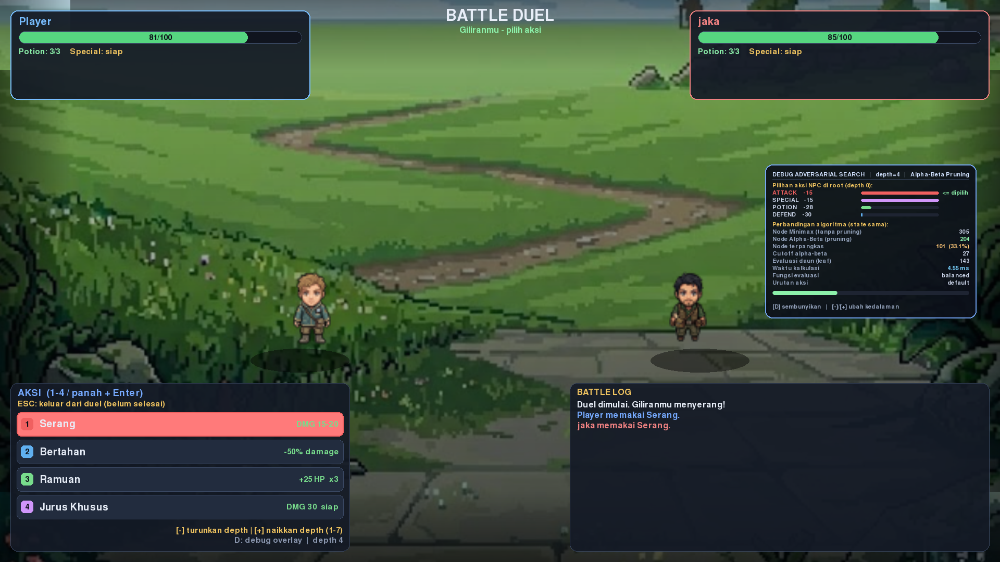
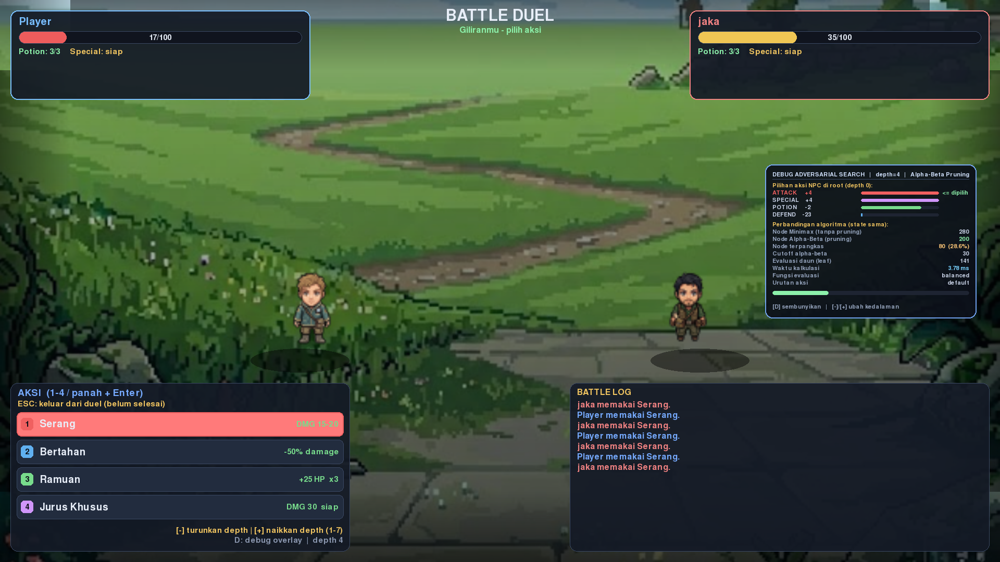
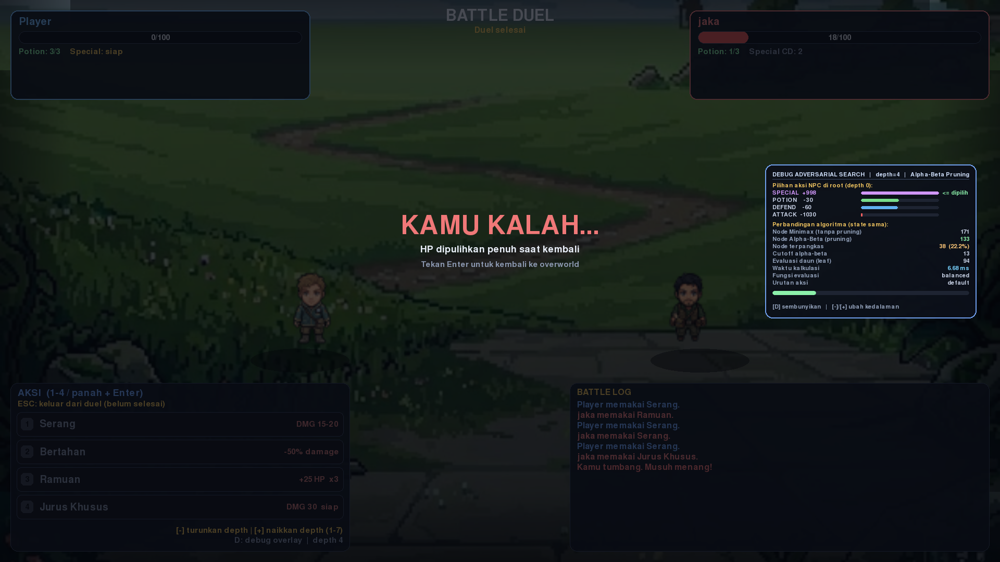
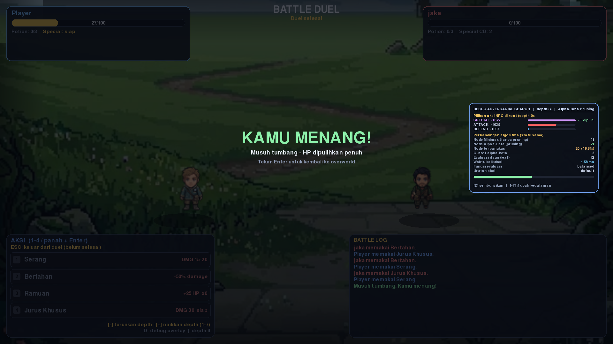

# Game AI — Adversarial Search

## Instalasi

```bash
pip install -r requirements.txt   # pygame 2.6.1, pygbag
python main.py                    # jalankan game
```

Python 3.10+. Yang dipakai paket `pygame`; `pygame-ce` juga jalan.

## Menjalankan duel

Musuh muncul 8 detik setelah game dinyalakan lalu mengejar player (mode follow,
bisa dimatikan dengan `F`). Duel mulai otomatis saat jarak Manhattan <= 1 ubin.
Setelah duel selesai HP player dipulihkan ke 100, posisi tidak berubah, dan
musuh muncul lagi setelah 5 detik.

Layar hasil tidak ditutup otomatis — tekan `Enter` — jadi ada waktu membaca
statistik overlay dulu.

| Tombol saat duel | Fungsi |
|---|---|
| `1` `2` `3` `4` | ATTACK / DEFEND / POTION / SPECIAL |
| `W` `S` / panah | Geser pilihan aksi |
| `Enter` / `Space` | Konfirmasi aksi, atau tutup layar hasil |
| `D` | Tampilkan / sembunyikan debug overlay |
| `-` / `+` | Kedalaman pencarian 1–7 (`=` juga bisa); overlay dihitung ulang di state yang sama |
| `ESC` | Keluar dari Battle Mode |

Overlay ada di sisi kanan layar duel: skor tiap aksi di akar, node minimax vs
alpha-beta, node terpangkas, cutoff, evaluasi daun, waktu kalkulasi, fungsi
evaluasi, dan urutan aksi. Tiap giliran NPC, minimax murni juga dijalankan
sebagai pembanding, jadi kedua angka node selalu tersedia.

## Adversarial Search

### Formulasi

| Unsur | Representasi |
|-------|--------------|
| State | `BattleState`: HP kedua pihak, sisa potion, cooldown, status defend, giliran |
| Pemain | NPC (maximizer) dan Player (minimizer) |
| Aksi | `ATTACK`, `DEFEND`, `POTION`, `SPECIAL` — branching maksimum 4 |
| Kedalaman | 4 ply (`DEFAULT_DEPTH = 4`) |
| Terminal | HP <= 0, skor `± WIN_SCORE` (1000) |
| Utilitas | `eval_balanced`: selisih HP + selisih potion x 10 + defend ± 15 |

### Algoritma

| Algoritma | Ide |
|-----------|-----|
| Minimax | NPC maksimalkan, Player minimalkan — patokan tanpa pruning |
| Alpha-beta | Pangkas subtree yang mustahil mengubah keputusan |
| Move ordering | Aksi terbaik dicoba lebih dulu supaya jendela menutup cepat |
| Early stop | Berhenti lebih awal bila `is_decided(state)` — hasil akhir sudah pasti |

Alpha-beta bukan algoritma baru, hanya minimax yang lebih hemat: hasilnya sama
persis, yang beda jumlah node. Buktinya di self-test `python adversarial_ai.py`
(aksi sama untuk depth 1–6; depth 6: 4031 → 805 node).

Konfigurasi duel: `alphabeta`, eval `balanced`, urutan `default`, depth 4,
early stop mati. Depth bisa diubah saat duel dengan `-` / `+`, overlay langsung
menghitung ulang angkanya.

### Hasil eksperimen

Dari `python experiments.py` (600 state acak, seed tetap).

| Kedalaman | Node minimax | Node alpha-beta | Hemat | + early stop |
|-----------|-------------|-----------------|-------|--------------|
| 4 | 140,3 | 101,9 | 27,4% | 32,9% |
| 5 | 454,6 | 217,3 | 52,2% | 56,6% |
| 6 | 1455,0 | 494,5 | 66,0% | 69,1% |
| 7 | 4628,7 | 982,1 | 78,8% | 81,1% |

- **Move ordering (E3):** urutan `aggressive` memangkas 37,2% node, skor tetap
  identik.
- **Branching (E7):** menambah aksi SPECIAL menaikkan kemenangan NPC dari
  40,0% jadi 93,3%.
- **Kedalaman (E4):** depth 5 memberi 72,5% keputusan sama dengan depth 7 tapi
  4,5x lebih murah — karena itu game memakai depth 4.
- **Horizon (E0):** di depth 4, HP player 100 butuh 10 ply untuk sampai akhir
  duel, jadi skor kemenangan belum pernah terlihat di awal duel.
- **Kompleksitas:** minimax O(b^d); alpha-beta O(b^d) terburuk, O(b^(d/2))
  terbaik, dengan b <= 4.

## Eksperimen

```bash
python experiments.py                         # E0-E7
python experiments.py --only E7               # satu eksperimen saja
python experiments.py --quick                 # iterasi lebih sedikit
python experiments.py --log-csv data/duel_log.csv   # + log per giliran NPC
python adversarial_ai.py                      # self-test alpha-beta vs minimax
```

`data/duel_log.csv` berisi log 60 duel (seed tetap, deterministik).

## Struktur Proyek

```text
Game AI/
├── main.py                        game loop, input, pemicu duel
├── player.py                      pergerakan Player (A* / UCS = Tahap 1)
├── npc.py                         NPC follow dengan A* (Tahap 1)
├── battle_system.py               duel: giliran, aksi, UI panel, tombol depth
├── adversarial_ai.py              Tahap 2: state, eval, minimax, alpha-beta
├── debug_overlay.py               BattleDebugOverlay (Tahap 2) + DebugOverlay (Tahap 1)
├── settings_menu.py               menu pengaturan
├── experiments.py                 harness E0-E7
├── requirements.txt               dependensi: pygame, pygbag
├── Readme.md                      dokumen yang sedang Anda baca
│
├── game/
│   ├── map/                       grid, collision, viewport, obstacle
│   ├── pathfinding/               A* dan UCS (Tahap 1)
│   └── adv_search/                facade ke adversarial_ai.py
│
├── docs/screenshots/              screenshot README
├── data/
│   ├── grid_override.txt          hasil simpan grid dari editor
│   └── duel_log.csv               log per giliran NPC, 60 duel
├── assets/images/                 sprite peta dan karakter
└── .github/workflows/deploy.yml   build pygbag + deploy GitHub Pages
```

## Dokumentasi

### Tampilan Battle Mode


### Tampilan Debug Overlay Pertarungan


### Tampilan Saat Bertarung


### Tampilan Saat Kalah


### Tampilan Saat Menang


## Kendali (Overworld)

| Tombol | Fungsi |
|-----|--------|
| `W` `A` `S` `D` / panah | Gerak manual 1 cell |
| Klik kiri | Berjalan otomatis ke titik yang diklik |
| `F` | Toggle NPC mengikuti Player |
| `R` | Reset status duel + respawn musuh (posisi player tetap) |
| `ESC` | Settings menu (saat duel: keluar dari Battle Mode) |
| `F11` | Toggle fullscreen |
